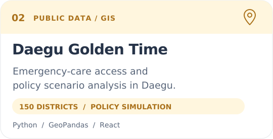
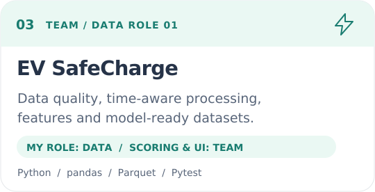
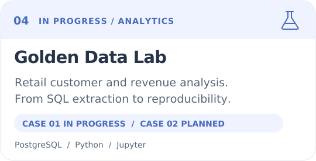

  

### 이현석 · 쓱싹

**데이터의 기준을 세우고, 분석 결과를 서비스로 연결합니다.**

Data Analytics · Data Quality · Public Data & GIS · Full-stack Projects

[FactoryHR Demo](https://factoryhr-frontend.onrender.com/) · [Golden Time Demo](https://ssg-sak.github.io/golden-project/) · [Repositories](https://github.com/ssg-sak?tab=repositories)

## About

행정학을 전공했고, 공공데이터 분석에서 시작해 데이터 검증·대시보드·웹서비스까지 작업 범위를 넓히고 있습니다. 관심 분야는 **데이터 분석, 운영 리포팅, BI, 공공·행정 데이터**입니다.

- 지표의 **분모·기간·단위·제외 조건**을 먼저 정리합니다.
- 결측·중복·시점·좌표를 확인하고, 분석 결과의 **근거와 한계**를 함께 남깁니다.
- 생성형 AI와 협업해 코드와 문서를 만들며, **문제 정의·설계 판단·결과 검토**를 직접 맡습니다.
- 분석에서 끝내지 않고 **API·화면·리포트·테스트**까지 연결하는 프로젝트를 만듭니다.

## Selected Projects

  
  
  
  

| Project | 작업 내용과 확인할 포인트 | Links |
| --- | --- | --- |
| **FactoryHR Lite** · 개인 | 제조업 직원·근태 관리, API·DB 이중 검증, 운영 KPI, PDF·CSV, 선택적 AI 요약. **합성 데이터 기반 데모**이며 인증은 미구현입니다. | [Code](https://github.com/ssg-sak/FactoryHR-Lite) · [Demo](https://factoryhr-frontend.onrender.com/) |
| **대구 골든타임** · 개인 | 대구 **150개 행정동**의 의료 접근성, GIS·도로 ETA·후보 입지 비교, 시민 탐색과 정책 분석 화면. 결과는 **정책 시뮬레이션**이며 실제 이송 성과를 뜻하지 않습니다. | [Code](https://github.com/ssg-sak/golden-project) · [Demo](https://ssg-sak.github.io/golden-project/) · [KPI](https://github.com/ssg-sak/golden-project/blob/main/docs/core/kpi.md) |
| **EV SafeCharge** · 팀 / DA① | **정의·품질·전처리·EDA·피처·데이터셋** 담당. 기준시각 이후 정보 차단, 관측 공백 **25분 초과 시 상태값 이어 채우기 중단**. 추천 점수·모델·API·UI는 다른 담당자의 범위입니다. | [Code & Role](https://github.com/ssg-sak/git-elctronic) |
| **Golden Data Lab** · 진행 중 | 소매 고객·매출 분석: **분석 질문·SQL 추출 계약 확정, 품질 노트북 초안**. RFM·코호트·Power BI로 확장할 계획이며, 청년 이동 분석은 기획 단계입니다. | [Code & Progress](https://github.com/ssg-sak/golden-data-lab) |

프로젝트 설명은 2026-08-28 저장소 공개 내용을 기준으로 정리했습니다. 데모는 무료 호스팅의 절전 상태에서 첫 응답이 늦을 수 있습니다.

<b>Latest project preview — FactoryHR Lite</b>

제조업 인력·근태 데이터를 조회하고 지표와 검증 결과를 확인하는 대시보드입니다.

[프로젝트 설명과 검증 기록](https://github.com/ssg-sak/FactoryHR-Lite#readme)

## Tech Stack

  <picture>
    <source media="(prefers-reduced-motion: reduce)" srcset="./assets/tech-stack.svg">
    
  </picture>

<b>기술별 역할 · 사용 경험과 학습 중인 항목 구분</b>

아래 기술은 프로젝트에서 사용한 도구이며, 모두 같은 숙련도를 뜻하지 않습니다.

| 영역 | 사용 기술 | 프로젝트에서의 역할 |
| --- | --- | --- |
| 데이터·분석 | Python, SQL, pandas, NumPy, Jupyter | 수집 데이터 정리, 전처리, 탐색·집계, 분석 과정 기록 |
| 공간·후보 분석 | GeoPandas, Shapely, scikit-learn | 공간 결합, 의료 접근성 비교, 후보권 생성 |
| 시각화 | Matplotlib, seaborn, Recharts | 분석 차트, 보고서 그림, 웹 대시보드 |
| 화면·상태·입력 | Next.js, React, TypeScript, Tailwind, Zustand, TanStack Query, React Hook Form, Zod | 화면 구성, 조회·캐싱·갱신, 폼과 입력 검증 |
| API·데이터베이스 | FastAPI, Pydantic, SQLAlchemy 2.x, psycopg, PostgreSQL, SQLite, Alembic | API, 요청·응답 검증, 데이터 접근·무결성, 스키마 변경 관리 |
| 리포트·AI | ReportLab, Matplotlib, Gemini API, httpx | PDF 생성, 계산된 KPI를 입력으로 받는 선택적 AI 요약 |
| 테스트·배포 | Pytest, Vitest, Playwright(smoke), Git, GitHub Actions, Docker Compose, Render, GitHub Pages | 분석·API·화면 검증, CI, 실행환경, 공개 배포 |
| 심화 학습 | Advanced SQL, Power BI, 통계 분석 | SQL 실습, BI 대시보드, 통계 해석 역량 보강 |

## Working Principles

**지표를 정의하고 → 데이터를 확인하고 → 결과를 검증하고 → 사용할 수 있는 형태로 만듭니다.**

원본과 가공본을 구분하고, 같은 결과를 다시 만들 수 있도록 실행 순서와 판단 근거를 기록합니다. 데이터가 말해 주지 않는 내용은 성과로 단정하지 않습니다.

  

Off the keyboard: San Francisco Giants · Hanwha Eagles ⚾

