# 슥삭슥삭 ⚡

**복잡한 데이터도, 슥삭슥삭.**

수집하고 · 정리하고 · 분석하고 · 확인합니다.

---

## ⚡ About SSG-SAK

공공데이터·공간분석 프로젝트를 만들며 데이터 분석가를 준비하고 있습니다. 지역별 의료 접근성처럼 공공데이터로 살펴볼 수 있는 문제에서 출발해, 충전소 상태 데이터와 고객·매출 데이터로 분석 경험을 넓히고 있습니다.

결과를 보기 전에 **무엇을 한 건으로 세는지, 빠진 데이터는 무엇인지, 어느 시점까지의 정보인지**부터 확인합니다. 분석에 쓴 기준과 한계를 기록하고, 다른 사람도 같은 결과를 확인할 수 있도록 코드와 문서를 함께 정리합니다.

관심 있는 일은 **데이터 분석, 데이터 품질·운영, 지표 관리와 리포팅, 공공·행정 데이터 분석**입니다.

## 🧰 Tech Stack

프로젝트에서 사용한 기술을 분야별로 정리했습니다. 학습 중인 도구는 별도로 표시했습니다.

### Data & Analytics

        

### Database

### Frontend

 

### Backend

 

### Testing & DevOps

     

### Currently Learning

 

SQL 분석 실습과 통계 해석을 계속 보강하고 있습니다. SQL 작업에는 DBeaver를 사용합니다.

## 🚀 Projects

### 01. 대구 골든타임 · 골든 거버넌스

**개인 프로젝트 | 공공데이터 · 공간분석 · 정책 검토**

시민용 응급의료기관 탐색과 대구 **150개 행정동**의 소아·고령층 의료 접근성 분석을 연결한 웹서비스입니다.

- 데이터 수집·정제, 공간분석, 지표 설계, 후보지 비교부터 웹서비스 구현·배포·문서화까지 진행했습니다.
- 인구와 도로 이동시간을 함께 사용해 지역별 접근성을 비교하고, 분석 조건을 바꿨을 때 후보가 얼마나 유지되는지 점검했습니다.
- 지표 정의, 데이터 품질 검사, 재현 절차를 문서로 남겼습니다. 결과는 **정책 시뮬레이션**이며 실제 구급차 이송 성과나 확정 입지를 뜻하지 않습니다.

`Python` `pandas` `GeoPandas` `scikit-learn` `FastAPI` `React`

[저장소](https://github.com/ssg-sak/golden-project) · [서비스](https://ssg-sak.github.io/golden-project/) · [지표 정의·운영 기록](https://github.com/ssg-sak/golden-project/blob/main/docs/core/kpi.md)

### 02. EV SafeCharge

**팀 프로젝트 | 담당: 데이터 정의·품질·전처리·EDA·피처·데이터셋**

도착 시 이용 가능성이 높은 충전소를 추천하기 위해, 추천·모델 담당자가 사용할 입력 데이터를 구성했습니다.

- 충전기 상태, 관측 시각, 갱신 지연을 구분하고 **미관측을 사용 불가로 처리하지 않는 기준**을 적용했습니다.
- 기준시각 이후 정보가 섞이지 않도록 처리하고, 관측 공백이 25분을 넘으면 이전 상태를 그대로 이어 붙이지 않도록 했습니다.
- 충전소별 현재 상태표와 시점별 이력표를 구성하고, 집계 방식에 따른 가용률 차이와 데이터의 한계를 정리했습니다.

추천 점수·모델·순위 산정과 서비스 화면은 다른 팀원의 담당 범위입니다. 아래 저장소에는 제 담당 작업과 검증 근거를 정리했습니다.

`Python` `pandas` `Parquet` `pytest`

[개인 담당 작업·검증 문서](https://github.com/ssg-sak/git-elctronic)

### 03. Golden Data Lab

**진행 중 | SQL · 데이터 품질 · 고객·매출 분석**

여러 도메인의 데이터를 분석하며 **질문 정의 → SQL 추출 → 품질 점검 → 분석 → 지표·시각화 → 해석·재현** 과정을 기록하는 포트폴리오입니다.

- 첫 사례는 UCI Online Retail II 거래 데이터의 취소·반품, 매출 정의, 고객별 구매 특성을 다룹니다.
- 현재는 분석 질문과 SQL 추출 기준을 정리하고, 데이터 품질 점검 노트북을 작성하는 단계입니다.
- RFM·코호트 분석과 Power BI 대시보드는 후속 작업으로 계획하고 있습니다. 완료된 결과와 진행 중인 작업을 구분해 기록합니다.

`SQL` `PostgreSQL` `Python` `pandas` `Jupyter`

[저장소·진행 상황](https://github.com/ssg-sak/golden-data-lab)

## 🧭 How I Work

- **집계 기준부터 정합니다.** 기간, 단위, 분모, 제외 조건이 달라지면 같은 데이터에서도 다른 결과가 나옵니다.
- **확인한 사실과 추정을 구분합니다.** 관측되지 않은 값, 분석의 가정, 해석의 한계를 결과와 함께 남깁니다.
- **AI와 함께 작업하고 결과를 검토합니다.** 코드·문서 작성에 AI를 활용하며, 분석 기준을 정하고 산출물을 확인하는 과정까지 제 작업으로 기록합니다.

---

**슥삭슥삭 / SSG-SAK**

프로젝트의 상세 방법, 데이터 출처, 검증 기록과 진행 상황은 각 저장소에서 확인할 수 있습니다.

