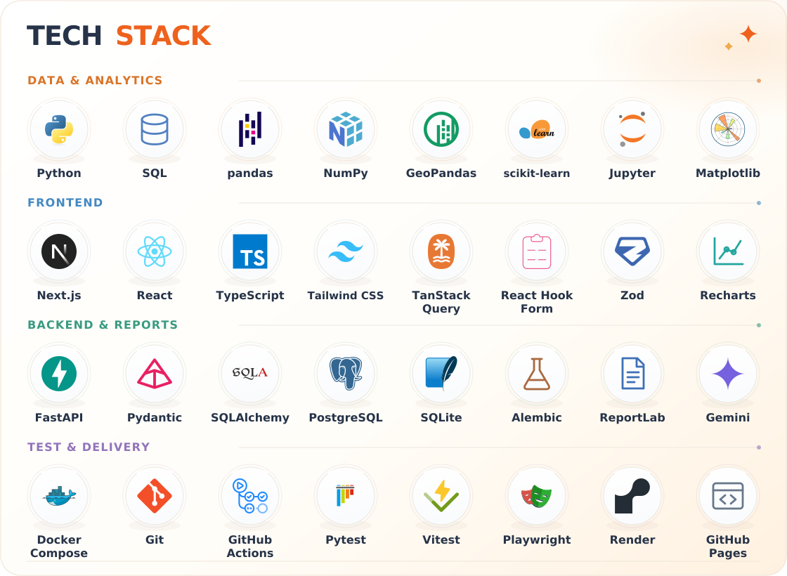
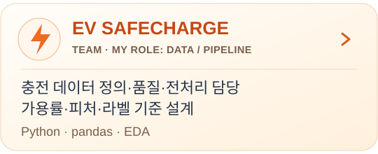
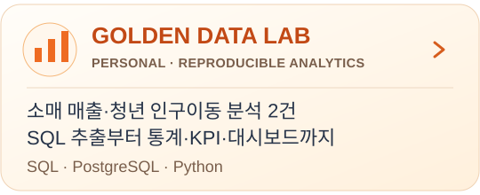

  

  <strong>Data Analytics</strong> · Data Operations · DB / Backend 
  Python·SQL 기반 분석을 데이터 품질 검증과 DB·API·서비스 구현으로 연결합니다.

  <picture>
    <source media="(max-width: 600px)" srcset="./assets/tech-stack-mobile.svg">
    
  </picture>

<h3 align="center">Featured Projects</h3>

  
  

  
  

